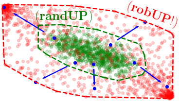

# Sampling-based Reachability Analysis: A Random Set Theory Approach with Adversarial Sampling

## Description

Code for the randUP (randomized uncertainty propagation) and robUP (robustified uncertainty propagation) algorithms, containing experiments for our paper at CoRL 2020 (https://arxiv.org/abs/2008.10180).

<p align="center">
  
  <br /><em>Three steps of randUP: (1) sample all uncertain parameters, (2) propagate them through the dynamics, and (3) take the convex hull of the states. Using random sets theory, we prove that this approximation converges to the convex hull of the true reachable sets.</em>
</p>

<br />

<p align="center">
  
  <br /><em>Adversarial sampling (robUP) improves accuracy by actively searching for parameters maximizing the size of the reachable sets.</em>
</p>


## Setup

Python 3.5.2 is required. It is advised to run the following commands within a virtual environment. 
```bash
  python -m venv ./venv
  source venv/bin/activate
```
For trajectory optimization of an uncertain spacecraft, clone ccscp
```bash
  git submodule init
  git submodule update
```
Then, install the package as
```bash
  pip install -r requirements.txt
```
Experiments can be reproduced using the notebooks in the exps/ folder
```bash
  jupyter notebook
```


## BibTeX
```
@inproceedings{LewPavone2020,
  title        = {Sampling-based Reachability Analysis: A Random Set Theory Approach with Adversarial Sampling},
  author       = {Lew, Thomas and Pavone, Marco},
  booktitle    = {Conference on Robot Learning},
  year         = {2020},
  url          = {https://arxiv.org/abs/2008.10180}
}
```
